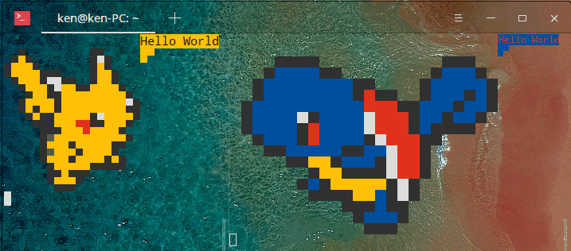

# Pikachusay
# Squirtlesay

### Update: Feb. 16, 2020

Requirement: pyparsing

```
./Pikachusay.py "Hello World"
./Squirtlesay.py "Hello World"
```

<p align='center'>

<iframe src="//player.bilibili.com/player.html?aid=40788253&cid=71638297&page=1" scrolling="no" border="0" frameborder="no" framespacing="0" allowfullscreen="true"> </iframe>
</p>

<iframe src="//player.bilibili.com/player.html?aid=40788253&cid=71638297&page=1" scrolling="no" border="0" frameborder="no" framespacing="0" allowfullscreen="true"> </iframe>

Enjoy~
